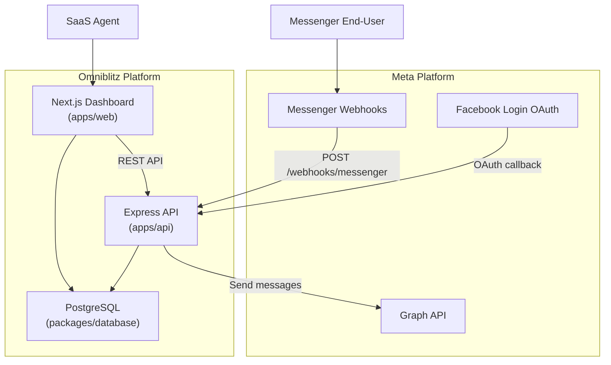
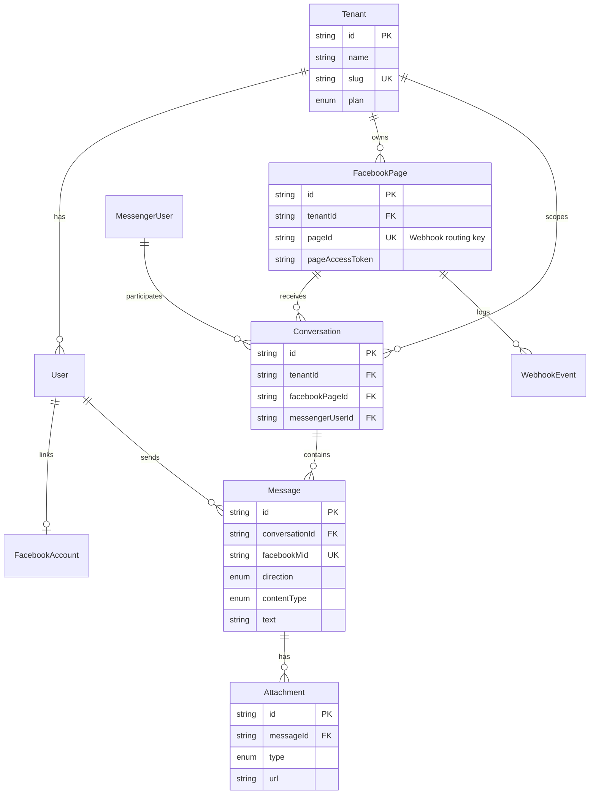

# Omniblitz Architecture

## System Context



## Multi-Tenant Data Model



## Webhook Routing Algorithm

The central design decision: **every inbound webhook is routed by `entry[].id` (Facebook Page ID)**.

```
POST /webhooks/messenger
│
├─ Verify X-Hub-Signature-256
├─ Respond 200 immediately (Facebook 20s timeout)
│
└─ For each entry in payload.entry:
   │
   ├─ pageId = entry.id
   ├─ pageContext = FacebookPage.findUnique({ pageId })
   │   └─ null → log + drop (unregistered page)
   │
   └─ tenantId = pageContext.tenantId
      │
      └─ For each entry.messaging[]:
         ├─ message      → upsert user → upsert conversation → save message + attachments
         ├─ delivery     → mark outbound messages delivered
         ├─ read         → mark outbound messages read
         └─ postback     → save as inbound text message
```

## Message Content Types

| Facebook attachment `type` | `MessageContentType` | `AttachmentType` | Storage |
|---|---|---|---|
| `text` (no attachment) | `TEXT` | — | `Message.text` |
| `image` | `IMAGE` | `IMAGE` | `Attachment.url` (FB CDN) |
| `audio` | `AUDIO` | `AUDIO` | `Attachment.url` + `durationMs` |
| `video` | `VIDEO` | `VIDEO` | `Attachment.url` |
| `file` | `FILE` | `FILE` | `Attachment.url` + `fileName` |
| `sticker` | `STICKER` | `STICKER` | `Message.sticker_id` |
| `fallback` | `FALLBACK` | `FILE` | `Attachment.url` |

## Security Layers

| Concern | Implementation |
|---|---|
| Webhook authenticity | HMAC-SHA256 signature verification on raw body |
| Tenant isolation | All queries filtered by `tenantId` from JWT/session |
| Page token storage | Encrypted at rest (add `crypto` wrapper in production) |
| OAuth state | Base64url-encoded `{ tenantId, userId }` prevents CSRF |
| API auth | JWT middleware on `/api/*` routes (to be added) |

## API Surface (Phase 1)

| Method | Path | Purpose |
|---|---|---|
| `GET` | `/webhooks/messenger` | Facebook verification handshake |
| `POST` | `/webhooks/messenger` | Inbound message router |
| `GET` | `/api/auth/facebook/login-url` | Generate OAuth redirect URL |
| `GET` | `/api/auth/facebook/callback` | Exchange code, store pages |
| `GET` | `/api/conversations` | Dashboard inbox list |
| `POST` | `/api/conversations/:id/messages` | Send outbound reply |

## Recommended Next Steps

1. **Auth** — Add NextAuth.js with email/password + tenant provisioning
2. **Real-time** — WebSocket or SSE for live inbox updates
3. **Media storage** — Mirror FB CDN attachments to S3/Cloudflare R2
4. **Queue** — BullMQ for async webhook processing at scale
5. **Bot engine** — Rule-based auto-replies before human handoff
